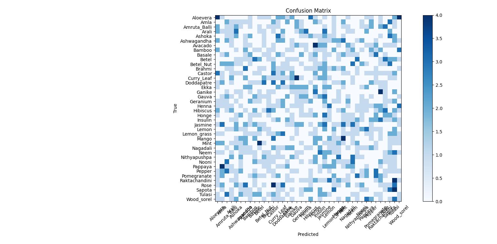

# 🌿 Medicinal Plant Leaf Classifier using Deep Learning

This project is a part of my Smart India Hackathon submission. It focuses on the classification of common Indian and Asian medicinal plants using Convolutional Neural Networks (CNN) and real image datasets.
---

## 🎯 Objective

To build a lightweight yet accurate image classification model that can identify medicinal plant species based on leaf images. This supports applications in:

- Herbal medicine research
- Ayurvedic product development
- Plant-based pharmaceutical identification
---

## 📁 Dataset

We used a real image dataset of Indian medicinal plant leaves, organized into folders per species.
[Kaggle dataset link](https://www.kaggle.com/datasets/warcoder/indian-medicinal-plant-image-dataset)

**Sample classes include:**
- Neem
- Tulsi
- Aloe Vera
- Brahmi
- ... (depending on dataset)

## 🧠 Model Architecture

- *Base model:* MobileNetV2 (transfer learning)
- *Framework:* TensorFlow 2.x / Keras
- *Input size:* 128x128
- *Final Layer:* Dense layer with softmax (multi-class)

### 🧪 Training Details

- 80% training, 20% validation split
- Data augmentation: rotation, zoom, shifts
- Optimizer: Adam
- Loss: Categorical Crossentropy
- Epochs: 10

---

## 📊 Evaluation

- *Classification Report*
- [Classification Report](Classification_Report.txt)

- *Confusion Matrix*
- Validation Accuracy: ~ 85% depending on dataset size

🖼 Output image:

---

## 🚀 How to Run

### 1. Install Required Libraries

pip install tensorflow scikit-learn matplotlib numpy pandas

### 2. Clone the Repository

git clone https://github.com/Priyodeep-Dutta2004/Medicinal_Plant_Classifier_Image.git
cd Medicinal_Plant_Classifier_Image

### 3. Run the Script

python Medicinal_Plant_Classifier.py

---

🔬 Future Scope

- Add support for Asian medicinal plants
- Include metadata features like leaf texture, region, medicinal use
- Deploy as an Android app for real-time identification
- Extend to herb root/flower classification

---

👤 Author

Priyodeep Dutta
Electrical Engineering | Machine Learning & Generative AI Enthusiast |
[LinkedIn](LinkedIn-priyodeep-dutta-965b37325) • [GitHub](Priyodeep-Dutta2004 (Priyodeep Dutta))

---

📄 License

This project is open-source for educational and research use.

---
